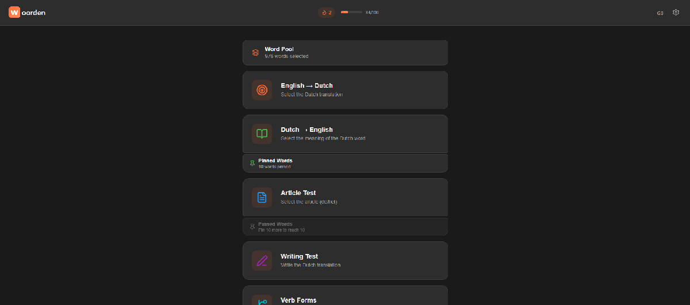

# Woorden

A spaced repetition PWA for learning Dutch vocabulary.

**Live app:** [woorden.vercel.app](https://woorden.vercel.app)



## Features

- **5 quiz types** — translate to Dutch, translate to native, article (de/het), writing test, verb forms
- **Spaced repetition** — word selection prioritizes unseen words, then last-wrong, then last-correct
- **Example sentences** — Dutch → Native quiz shows a contextual sentence with the target word highlighted (~2700 sentences)
- **Pin system** — mark difficult words and practice them in a dedicated quiz (unlocks at 10 pins)
- **Word packs** — enable or disable CEFR levels independently in settings
- **Multi-language UI** — Turkish, English, Arabic, French
- **Daily streak and goal tracking** — minimum 100 words/day with personal best
- **PWA** — installable, works offline
- **Export / import** — progress data saved to localStorage, exportable as JSON

## Word Packs

| Level | Words |
|-------|-------|
| A1    | 976   |
| A2    | 981   |
| A2+   | 687   |
| **Total** | **2644** |

## Tech Stack

- [Preact](https://preactjs.com/) — React-compatible, ~3KB
- TypeScript
- Vite + vite-plugin-pwa (Workbox)
- Lucide icons

## Getting Started

```bash
npm install
npm run dev      # development server
npm run build    # production build
npm run preview  # preview production build
```
